<p align="center">
  
</p>

<h1 align="center">Off Grid AI</h1>

<p align="center">
  <strong>Private, on-device AI. Your models, your data — no cloud, no accounts, no API keys.</strong>
</p>

<p align="center">
  A local-first AI runtime + studio — run open models (<em>text, vision, image, voice, speech</em>)
  entirely on your machine, behind one OpenAI-compatible gateway. Plus an always-on layer that
  <em>sees, remembers, reflects, and acts</em> — all on-device.
</p>

<p align="center">
  <a href="https://github.com/off-grid-ai/desktop/releases/latest">Download (macOS)</a> ·
  <a href="docs/FEATURES.md">Features</a> ·
  <a href="https://getoffgridai.co">getoffgridai.co</a> ·
  <a href="https://getoffgridai.co/pay">Get Pro</a>
</p>

<p align="center">
  
  
  
</p>

<p align="center">
  <strong><a href="https://github.com/off-grid-ai/mobile">Off Grid AI Mobile</a></strong> — the same on-device AI, on your phone &nbsp;·&nbsp;
  <a href="https://github.com/off-grid-ai/mobile"></a>
  &nbsp;·&nbsp; 100k+ downloads
</p>

---

## What it is

Off Grid AI is a **local-first AI runtime** for your desktop. Download open models from the
built-in catalog (or any GGUF from Hugging Face) and use them across every modality — all
inference runs on your hardware via bundled `llama.cpp`, `stable-diffusion.cpp`,
`whisper.cpp`, and Kokoro. Nothing routes through a server we own; your conversations,
files, and models never leave your device.

Three things in one app:

1. **A studio** — chat (text + vision + reasoning), on-device image generation, voice
   in/out, live artifacts/canvas, projects with RAG, and in-chat tools — a local
   Claude/LM-Studio/Ollama with everything on-device.
2. **A gateway** — one local OpenAI-compatible API (`http://127.0.0.1:7878/v1`, no key)
   for chat, vision, image, audio, and embeddings. Run it headless as just the gateway.
3. **Off Grid Pro** — an always-on private layer that *sees* your work (screen → OCR),
   *remembers* it, helps you *reflect*, and *acts* with your approval. On-device, opt-in.

## A look inside

<table>
<tr>
<td width="50%"><strong>Chat</strong> — text, vision, reasoning, artifacts, on-device<br>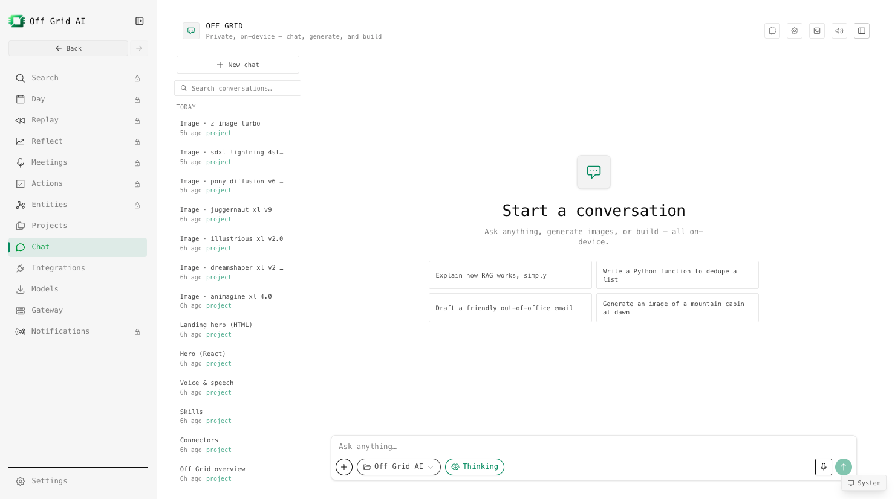</td>
<td width="50%"><strong>Models</strong> — curated catalog + Hugging Face search<br>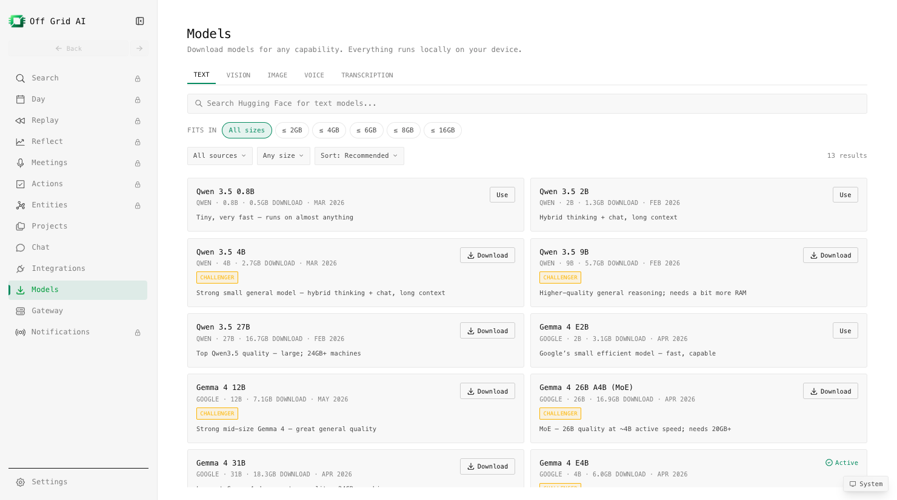</td>
</tr>
<tr>
<td width="50%"><strong>The Gateway</strong> — one local OpenAI-compatible API<br>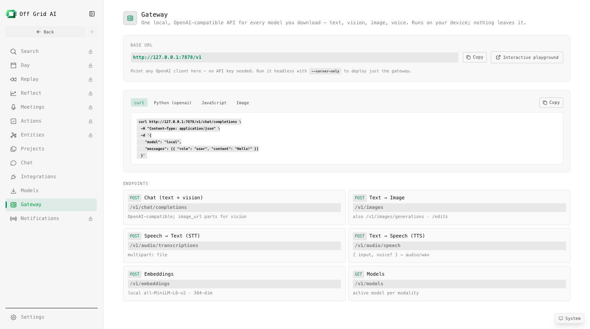</td>
<td width="50%"><strong>Projects</strong> — group chats, RAG over your docs<br>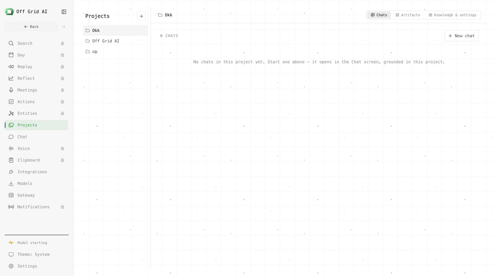</td>
</tr>
<tr>
<td width="50%"><strong>Connectors (MCP)</strong> — add servers, use them in chat<br>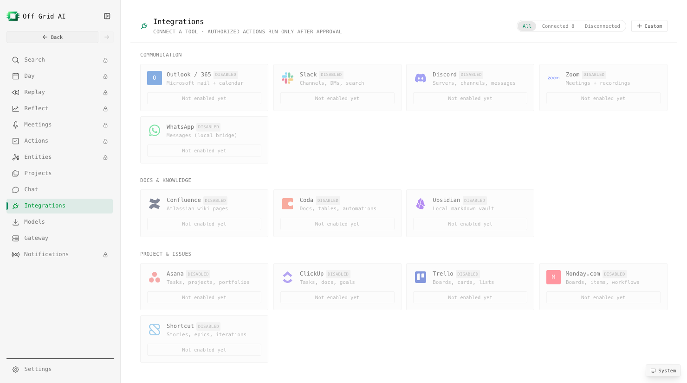</td>
<td width="50%"><strong>Artifacts</strong> — HTML, React, SVG &amp; Mermaid in a local sandbox<br>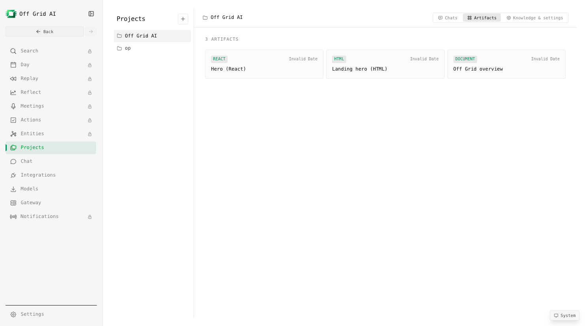</td>
</tr>
<tr>
<td width="50%"><strong>Off Grid Pro</strong> — the sees/remembers/reflects/acts layer<br>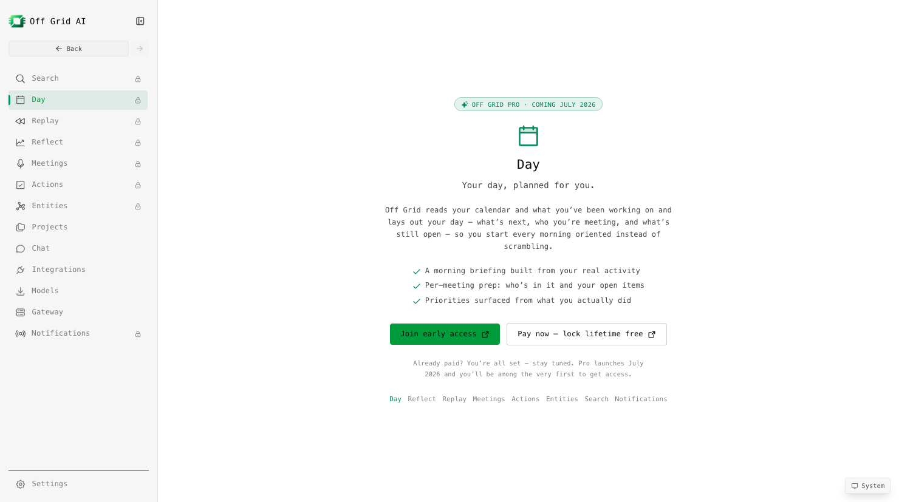</td>
<td width="50%"><strong>Private by default</strong> — runs on your machine, no account<br>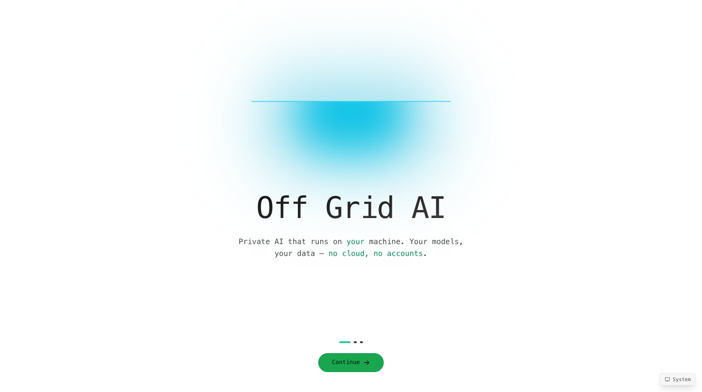</td>
</tr>
</table>

## Features (free & open source)

The free, open app is a complete on-device AI studio:

- **Chat** — text + vision, streaming, with a reasoning ("thinking") mode and per-chat
  model settings (temperature, context window).
- **Image generation** — text→image and image→image via `stable-diffusion.cpp` (Metal).
  Ships **SDXL-Lightning** (few-step, fast), SDXL, SD 1.5/2.1, and **Z-Image-Turbo**
  (2026 flagship, ~8-step). Live per-step preview, progress + ETA, cancel, lightbox, and
  an artifacts gallery of everything you've generated.
- **Voice** — speech-to-text (whisper) and text-to-speech (**Kokoro-82M**, multilingual),
  plus a hands-free voice mode.
- **Artifacts / canvas** — the model's HTML, React/JSX, SVG, Mermaid, and Markdown render
  live in a sandboxed iframe (no network/file access); Code/Preview toggle, download,
  saved per chat & project.
- **Projects** — group chats, upload documents (txt/md/PDF/DOCX, image, audio, video) and
  chat grounded in them (RAG with cited sources); per-project instructions.
- **Tools in chat** — an agentic loop calls local tools mid-conversation: built-ins
  (calculator, datetime) plus any MCP connector you've added.
- **Connectors (MCP)** — add Model Context Protocol servers (none / token / OAuth) and use
  them right inside chat. Preset catalog included.
- **Model catalog** — curated, size-bucketed recommendations + direct Hugging Face search;
  download, manage, and set the active model per modality.
- **The Gateway** — one OpenAI-compatible endpoint for everything; see below.
- **Auto-update** — signed releases update themselves.

A full breakdown is in [docs/FEATURES.md](docs/FEATURES.md).

## The Gateway

One local server (`http://127.0.0.1:7878`) speaks the OpenAI API:

| Capability | Endpoint |
|---|---|
| Chat (text + vision) | `POST /v1/chat/completions` |
| Text → Image | `POST /v1/images` (`/generations`, `/edits`) |
| Speech → Text | `POST /v1/audio/transcriptions` |
| Text → Speech | `POST /v1/audio/speech` |
| Embeddings | `POST /v1/embeddings` |
| Models | `GET /v1/models` |

```bash
curl http://127.0.0.1:7878/v1/chat/completions \
  -H "Content-Type: application/json" \
  -d '{"model":"local","messages":[{"role":"user","content":"Hello!"}]}'
```

```python
from openai import OpenAI
client = OpenAI(base_url="http://127.0.0.1:7878/v1", api_key="not-needed")
print(client.chat.completions.create(model="local",
      messages=[{"role":"user","content":"Hello!"}]).choices[0].message.content)
```

Interactive API reference + an OpenAPI spec are served at `/docs` and `/openapi.json`.

### Run just the gateway (headless)

You don't need the desktop UI to serve models — run **only** the gateway (no UI, no
capture) and point any OpenAI client at it. Ideal for a server, a homelab box, or wiring
local models into your own apps:

```bash
# from a built app
/Applications/Off\ Grid\ AI.app/Contents/MacOS/Off\ Grid\ AI --server-only
# or from source
OFFGRID_SERVER_ONLY=1 npm run gateway
```

It's **self-sufficient** — manage models over HTTP, no UI required:

| Action | Endpoint |
|---|---|
| List the catalog | `GET /v1/models/catalog` |
| List installed | `GET /v1/models/installed` |
| Active model per modality | `GET /v1/models/active` |
| **Pull** a model | `POST /v1/models/pull` `{ "id": "…" }` → poll `GET /v1/models/pull/status?id=…` |
| **Activate** a model | `POST /v1/models/activate` `{ "id": "…", "kind"?: "image\|speech\|transcription" }` |
| **Delete** a model | `POST /v1/models/delete` `{ "id": "…" }` |

```bash
# pull a model into a headless gateway, then chat
curl -X POST http://127.0.0.1:7878/v1/models/pull \
  -H 'Content-Type: application/json' -d '{"id":"unsloth/gemma-4-E4B-it-GGUF"}'
curl -X POST http://127.0.0.1:7878/v1/models/activate \
  -H 'Content-Type: application/json' -d '{"id":"unsloth/gemma-4-E4B-it-GGUF"}'
```

## Off Grid Pro — available now

The free app **runs** models. **Pro** adds the always-on layer that turns your own work
into private, on-device memory — and an assistant that helps you act on it. Everything is
explicit opt-in, with a visible recording indicator, and nothing leaves the device.

- **Sees** — screen capture → OCR → on-device LLM distill into observations + entities.
  Multi-monitor aware, consumption-vs-work classification, blank/locked frames skipped.
- **Remembers** — **Day** (a persisted journal with time blocks), **Entities** (a private
  CRM-for-everything: people, projects, companies, auto-built with synthesis summaries),
  and **Replay** (a "movie of your day" you can scrub and play back).
- **Reflects** — mind-share, balance, context-switching, and Day/Week trends.
- **Meetings** — records **Google Meet + Zoom** (screen + system audio + mic), transcribes
  locally with whisper, and folds an LLM title/summary/attendees into your timeline.
- **Clipboard** — a private clipboard manager: searchable history of everything you copy,
  with image, PDF, and file previews, a quick-paste popup, all stored on-device.
- **Acts (with approval)** — action items detected from your communication, an
  approval queue + audit log (nothing executes without a logged approval), MCP connectors
  as authoritative sources, and a skills framework (trigger → action) — on the roadmap
  toward a proactive secretary and a prospective "Ahead" view of your day.

**Pro is live.** Buy a license at **[getoffgridai.co/pay](https://getoffgridai.co/pay)** — you're
emailed a license key, you install the Pro build, and you activate the key in-app. Licensing runs
on **[Keygen](https://keygen.sh)**, and one Pro license covers up to **5 devices**. Pro features
live in a separate **private** package; the open core never imports it — see
[Architecture](#architecture--open-core). The Pro build is license-gated at runtime, so it stays
locked until a valid key is activated.

<table>
<tr>
<td width="50%"><strong>Day</strong> — your day, planned from real activity<br>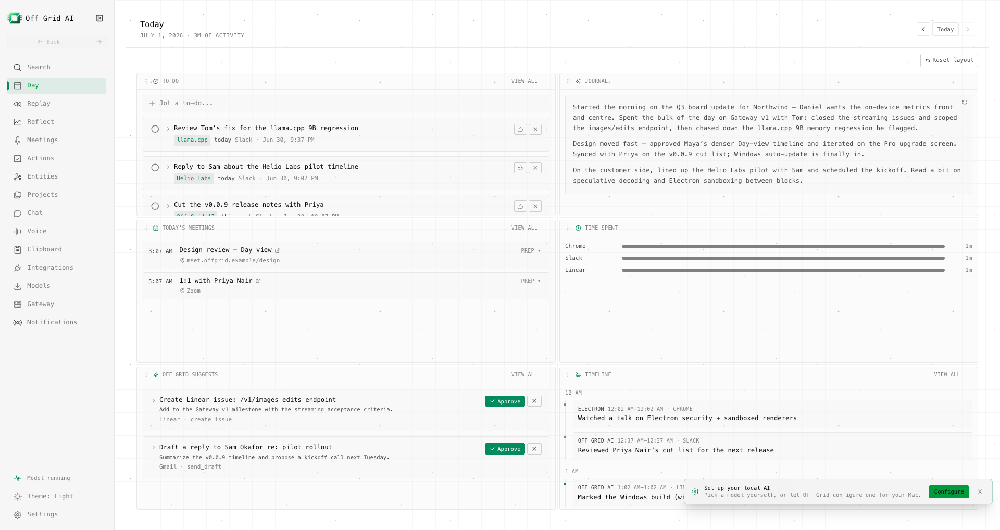</td>
<td width="50%"><strong>Entities</strong> — a private CRM, auto-built<br>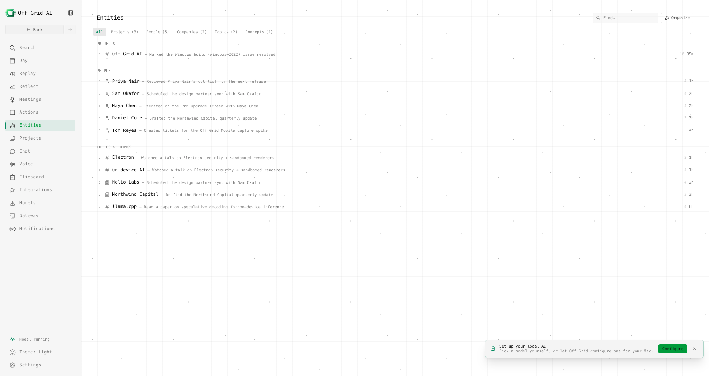</td>
</tr>
<tr>
<td width="50%"><strong>Reflect</strong> — where your attention actually went<br>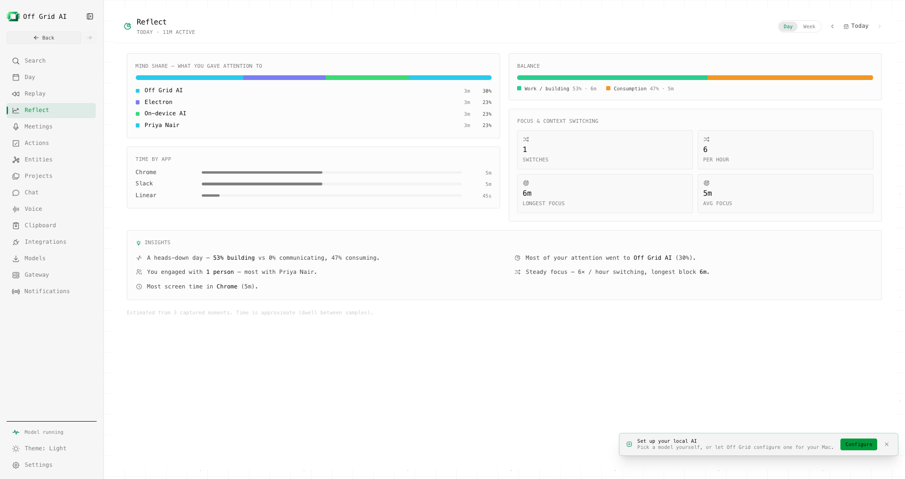</td>
<td width="50%"><strong>Search</strong> — unified search across everything<br>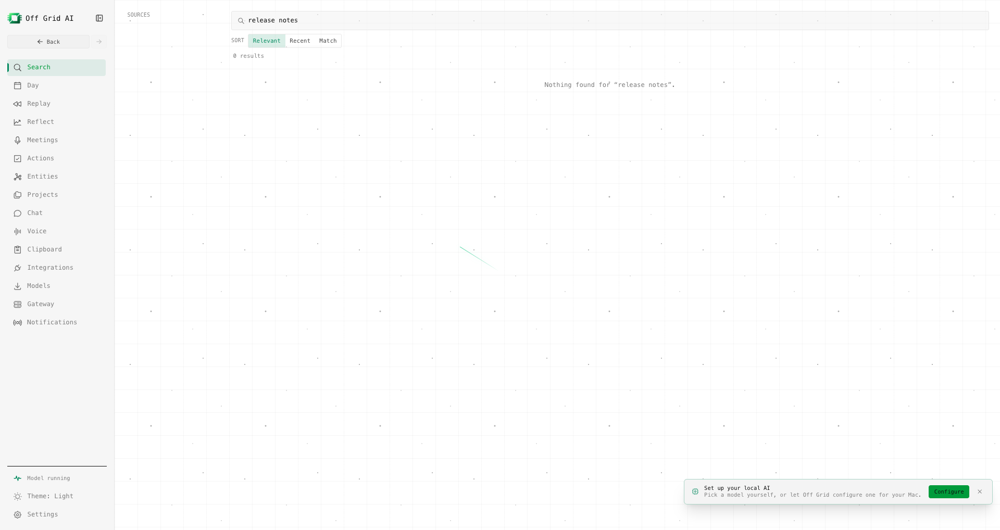</td>
</tr>
<tr>
<td width="50%"><strong>Meetings</strong> — recorded + transcribed locally<br>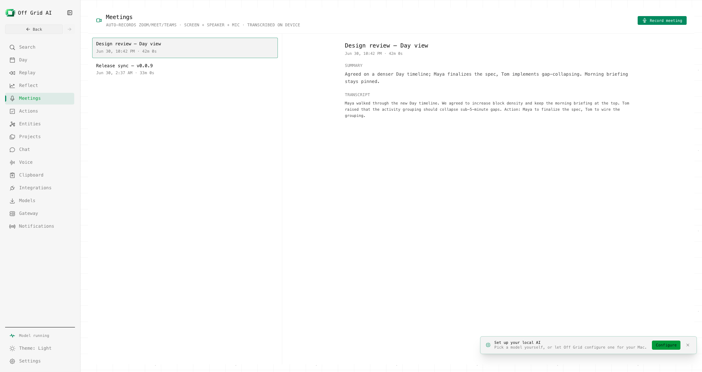</td>
<td width="50%"><strong>Replay</strong> — rewind your screen like a film<br>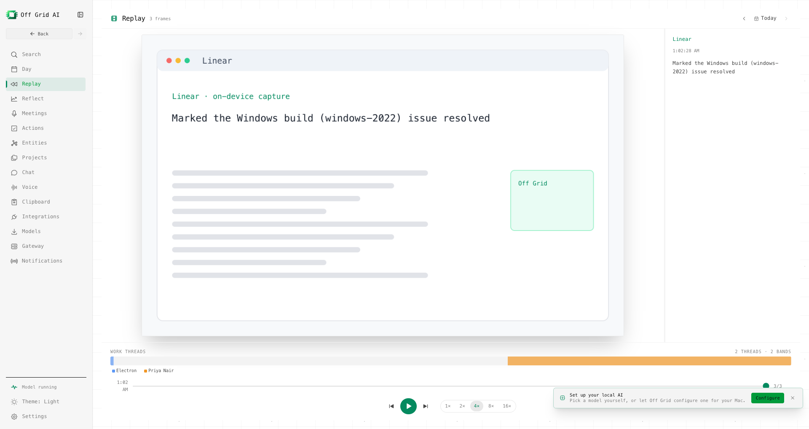</td>
</tr>
</table>

<sub>Pro screens shown with synthetic demo data.</sub>

→ **[Get Pro](https://getoffgridai.co/pay)** — buy a license, install the Pro build, activate your key.

## Install

Grab the latest build from [Releases](https://github.com/off-grid-ai/desktop/releases/latest):

- **macOS** (Apple Silicon) — signed + notarized `.dmg`

macOS only for now.

## Build from source

```bash
git clone https://github.com/off-grid-ai/desktop.git
cd desktop
npm install
npm run dev          # full app
npm run gateway      # headless gateway only (:7878)
npm run build:mac    # package a macOS app
```

Stack: Electron 39 + React 19 + Tailwind v4 (electron-vite),
`better-sqlite3-multiple-ciphers` (encrypted local DB), `@lancedb/lancedb` (vectors),
bundled `llama.cpp` / `whisper.cpp` / `stable-diffusion.cpp` / `ffmpeg` in `resources/bin`.
Shared `@offgrid/*` packages (design, models, rag) come from the workspace. Verify changes
with `npm run typecheck` before declaring done.

## Architecture — open core

This repository is the **open, AGPL core**: the model runner, gateway, studio (chat,
image, voice, artifacts), projects, connectors, and the model catalog. Pro features live in
a separate **private** package loaded as a git submodule (`pro/`). The core **never imports
pro** — pro registers itself through small registries (an `activate()` pattern) and is
simply absent in this build, so the open app compiles and runs entirely on its own.

## Privacy

All model inference is local. Your conversations, documents, and models stay on your device
— there's no cloud inference, no account, and no API key. You can run it fully offline.

## License

[AGPL-3.0-only](LICENSE). © Off Grid AI / Wednesday Solutions, Inc.
