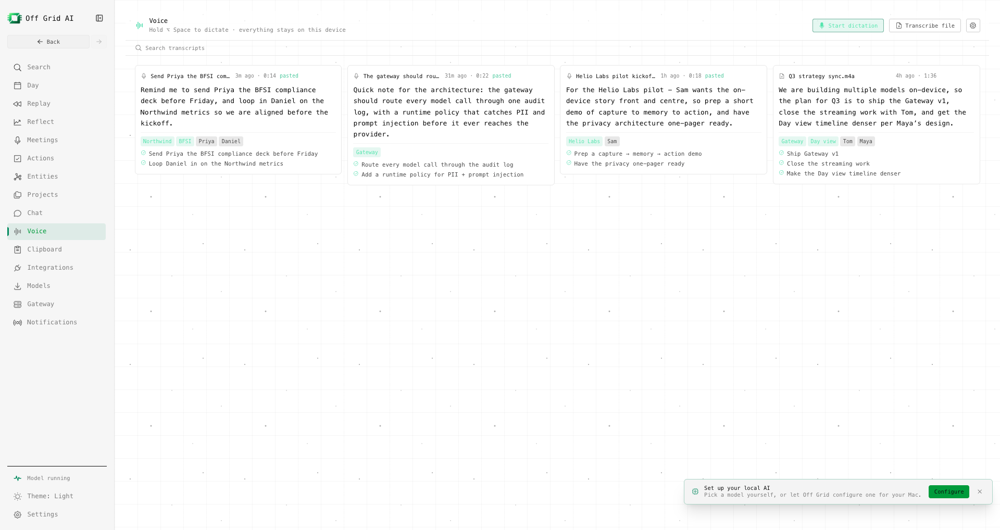
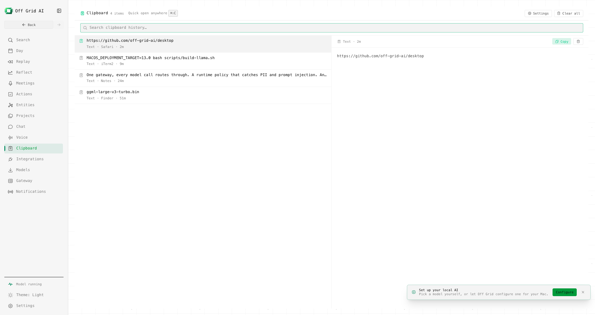
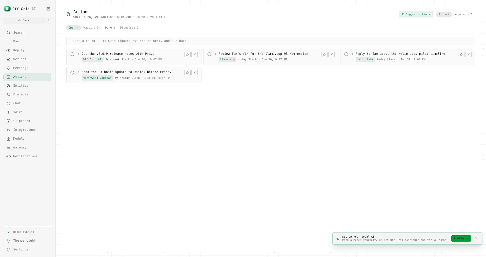
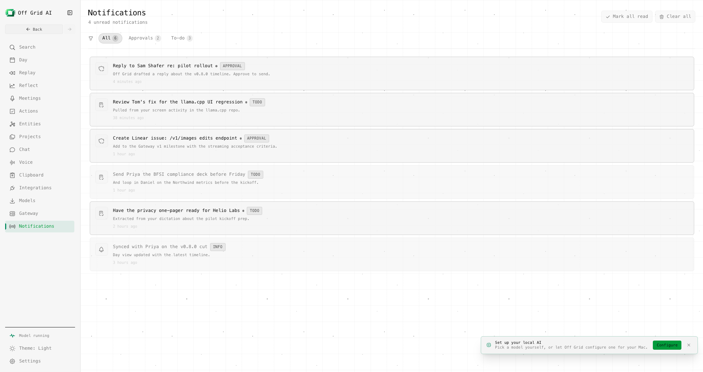

# Off Grid Pro — coming July 2026

[← All features](../FEATURES.md)

The free app **runs** models. **Pro** adds the always-on layer that **sees, remembers, and
acts**, on-device:

- **Never forgets** — remembers everything you see and do.
- **Unified search** across captured activity, meetings, and connectors.
- **Private CRM** — auto-built people/project/company records with cross-source summaries.
- **Day · Reflect · Replay** — your day planned, where time goes, rewind your screen.
- **Meetings** — local recording + transcription.
- **[Dictation](dictation.md)** — hold ⌥Space, talk, on-device whisper pastes at your cursor.
- **[Clipboard](clipboard.md)** — searchable copy history with a quick-paste popup.
- **Proactive secretary** — surfaces what matters, drafts actions (approval-gated).
- **Skills automation** — trigger → action (schedule / keyword / event).

## See it

<table>
<tr>
<td width="50%"><strong>Replay</strong> - rewind your screen, second by second </td>
<td width="50%"><strong>Day</strong> - your day planned, where the time went </td>
</tr>
<tr>
<td width="50%"><strong>Unified search</strong> - across activity, meetings, connectors </td>
<td width="50%"><strong>Private CRM</strong> - auto-built people, project, company records </td>
</tr>
<tr>
<td width="50%"><strong>Reflect</strong> - mind-share on what you have been doing </td>
<td width="50%"><strong>Meetings</strong> - local recording + transcription </td>
</tr>
<tr>
<td width="50%"><strong><a href="dictation.md">Dictation</a></strong> - talk, transcribed on-device, pasted anywhere </td>
<td width="50%"><strong><a href="clipboard.md">Clipboard</a></strong> - searchable history + quick-paste popup </td>
</tr>
<tr>
<td width="50%"><strong>Proactive secretary</strong> - surfaces what matters, drafts actions </td>
<td width="50%"><strong>Notifications</strong> - approvals and to-dos pulled from your activity </td>
</tr>
</table>

> Screenshots use synthetic demo data - no real captured activity.

Pro launches **July 2026** — already paid? You're first in line when it ships.

→ [Join early access](https://getoffgridai.co/early-access/) (free) · or
[pay now](https://getoffgridai.co/pay) for lifetime free + first access.
